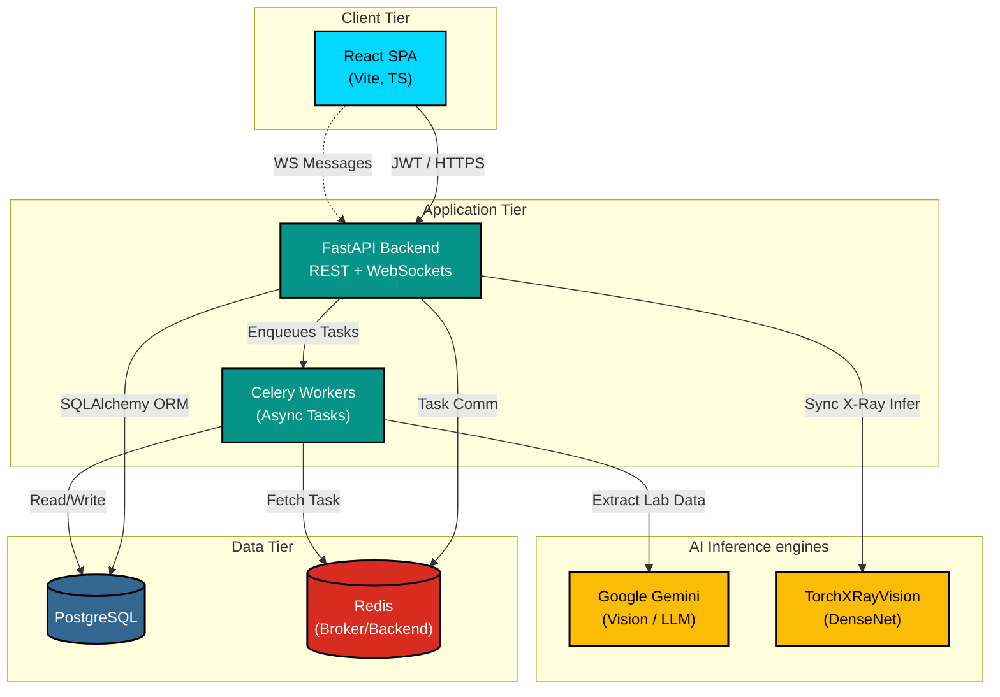

# DiagnoAI — Intelligent Healthcare Diagnostics

[](https://www.python.org/)
[](https://fastapi.tiangolo.com/)
[](https://reactjs.org/)
[](https://www.typescriptlang.org/)
[](./LICENSE)
[](./docs/DEPLOYMENT.md)

🌐 **Live Demo:** [https://diagnoai.app](https://diagnoai.app)

DiagnoAI is a full-stack AI-powered diagnostic system designed to assist healthcare professionals in analyzing medical imaging (X-Rays) and laboratory reports. It ships with two frontends — a **React + Vite SPA** for production use and a **Streamlit** app for rapid prototyping and demos.

📖 **Docs:** [API Reference](./docs/API.md) · [Deployment Guide](./docs/DEPLOYMENT.md) · [Contributing](./CONTRIBUTING.md)

## Features

- **🔬 X-Ray Analysis**: Automated detection of conditions like Pneumonia, COVID-19, and Fractures from X-ray images using deep learning (TorchXRayVision), processing synchronously for immediate results.
- **🧪 Lab Report Analysis**: Intelligent parsing of PDF/Image lab reports using OCR (Google Gemini Vision), with automatic interpretation of values against reference ranges and clinical flags (H/L/*).
- **🤖 Context-Aware Medical Chatbot**: A global AI assistant that understands the medical report currently on your screen and answers your health queries in plain English.
- **📝 Intelligent Insights**: Confidence scores, probability distributions, and plain-English clinical recommendations.
- **🔒 Secure by Design**: JWT authentication, CSRF protection, bcrypt password hashing, rate limiting, security headers, input validation, and role-based access control (RBAC).
- **🔑 Modern Auth Options**: Email/password login, Google sign-in, forgot-password flow, and token-based password reset.
- **📊 Report History**: Persistent report storage with per-user history and resource-level authorization.
- **🛠️ Admin Control**: User activation/deactivation, role management, and bulk report deletion.
- **⚡ Background Processing**: Long-running Lab OCR tasks run asynchronously via Celery + Redis.
- **🔔 Real-time Notifications**: WebSockets-based real-time updates for background tasks and system alerts.
- **💬 AI Feedback System**: Users can rate AI analysis accuracy (👍/👎 + comments), helping improve model quality over time.

## Architecture



| Layer             | Technology                                |
|-------------------|-------------------------------------------|
| Frontend (SPA)    | React 18, TypeScript, Vite, Tailwind CSS  |
| Frontend (Demo)   | Streamlit                                 |
| Backend API       | FastAPI, Pydantic, SQLAlchemy, WebSockets  |
| Authentication    | JWT (python-jose), bcrypt (passlib), CSRF |
| Database          | PostgreSQL, Alembic migrations            |
| Task Queue        | Celery + Redis                            |
| AI / ML           | PyTorch, TorchXRayVision, Google Gemini   |
| Testing           | pytest (backend), Vitest (frontend)       |
| Deployment        | Azure VM (Ubuntu 22.04), Docker, Nginx    |

## Quick Start

### Prerequisites
- Node.js (v18+)
- Python (3.10+ recommended)
- Docker (recommended for PostgreSQL + Redis)

### 1) Start Infrastructure (PostgreSQL + Redis)

```bash
docker compose up -d
```

### 2) Backend Setup

```bash
cd backend
python -m venv venv
# Windows
venv\Scripts\activate
# Linux/Mac
source venv/bin/activate

pip install -r requirements.txt
```

Create `backend/.env`:

```env
JWT_SECRET_KEY=<YOUR_JWT_SECRET_KEY>
GEMINI_API_KEY=<YOUR_GEMINI_API_KEY>
DATABASE_URL=postgresql://postgres:<YOUR_DB_PASSWORD>@localhost:5432/diagnoai
CELERY_BROKER_URL=redis://localhost:6379/0
CELERY_RESULT_BACKEND=redis://localhost:6379/1
ADMIN_REGISTRATION_KEY=<YOUR_ADMIN_SECRET_KEY>
GOOGLE_CLIENT_ID=<YOUR_GOOGLE_OAUTH_CLIENT_ID>
FRONTEND_URL=http://localhost:5173
SMTP_HOST=<YOUR_SMTP_HOST>
SMTP_PORT=587
SMTP_USERNAME=<YOUR_SMTP_USERNAME>
SMTP_PASSWORD=<YOUR_SMTP_PASSWORD>
SMTP_SENDER_EMAIL=<YOUR_SENDER_EMAIL>
SMTP_USE_TLS=true
APP_ENV=development
```

Run database migrations:

```bash
alembic upgrade head
```

Run API:

```bash
uvicorn app.main:app --reload
```

Run worker in a second terminal:

```bash
celery -A app.celery_app.celery_app worker --loglevel=info
```

Server runs at `http://localhost:8000` and docs at `http://localhost:8000/docs`.

### 3) Frontend Setup

```bash
cd frontend
npm install
npm run dev
```

Optional `frontend/.env` for Google sign-in:

```env
VITE_GOOGLE_CLIENT_ID=<YOUR_GOOGLE_OAUTH_CLIENT_ID>
VITE_API_URL=http://localhost:8000/api
```

Client runs at `http://localhost:5173`.

## 🚀 Production Deployment

DiagnoAI is deployed on **Azure VM (Ubuntu 22.04)** using Docker + Nginx.

**Live at:** [https://diagnoai.app](https://diagnoai.app)

### Infrastructure
- **VM:** Azure Standard B2s (2 vCPU, 4GB RAM)
- **Reverse Proxy:** Nginx with SSL (Let's Encrypt)
- **Database:** PostgreSQL 15 (Docker)
- **Cache/Queue:** Redis 7 (Docker)
- **Email:** Resend SMTP (`noreply@diagnoai.app`)

### Deploy

```bash
docker compose -f docker-compose.prod.yml up -d --build
```

For full deployment guide see [docs/DEPLOYMENT.md](./docs/DEPLOYMENT.md).

## Testing

### Backend Tests (pytest)

```bash
cd backend
pytest tests/ -v --ignore=tests/test_api.py
```

### Frontend Tests (Vitest)

```bash
cd frontend
npm test
```

## Known Limitations

- Mobile layout not fully optimized (planned improvement)
- WebSocket reconnection is manual (handled by useWebSocket hook)
- X-Ray model supports chest X-rays only currently
- Lab report OCR accuracy depends on image quality
- Hosted on Azure B2s VM — may be slow during peak load (PyTorch on CPU)

## Changelog

### v1.3.0 (April 2026)
- ✅ Production deployment on Azure VM (Standard B2s)
- ✅ Custom domain `diagnoai.app` with SSL (Let's Encrypt)
- ✅ Email system via Resend (`noreply@diagnoai.app`)
- ✅ Fixed Alembic migration issues for fresh database deployments
- ✅ Docker production optimization (single image reuse for API + Celery worker)
- ✅ CSRF middleware fixes for HTTPS production environment
- ✅ Added missing user columns migration (phone, bio, location, profile_image_url, specialization)
- ✅ Added feedback table migration
- ✅ Gemini model updated to `gemini-2.5-flash`

### v1.2.0 (April 2026)
- ✅ Added DiagnoAI Medical Assistant — a global, context-aware chatbot widget
- ✅ Integrated Gemini 2.5 Flash for rapid chatbot responses
- ✅ Added `useChatStore` state management for dynamic context injection

### v1.1.0 (March 2026)
- ✅ Added AI feedback system — users can rate analysis accuracy
- ✅ Centralized frontend error handling with user-friendly messages
- ✅ Resource-level authorization on report history and deletion
- ✅ Improved CSP security headers
- ✅ New comprehensive authorization test suite (20+ test cases)
- ✅ Full API reference documentation (`docs/API.md`)
- ✅ Production deployment guide (`docs/DEPLOYMENT.md`)

### v1.0.0 (March 2026)
- Initial release with X-Ray and Lab analysis
- JWT authentication, Google OAuth, CSRF protection
- Role-based access control (patient / doctor / admin)
- Email verification and password reset flows
- PDF report generation
- Celery + Redis background processing
- WebSocket real-time notifications

## License

MIT